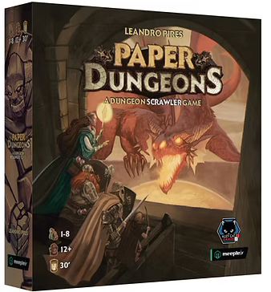
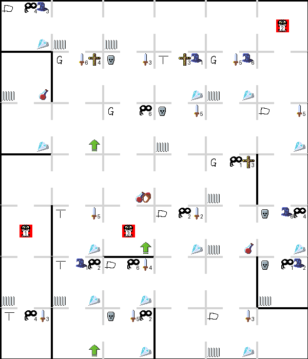
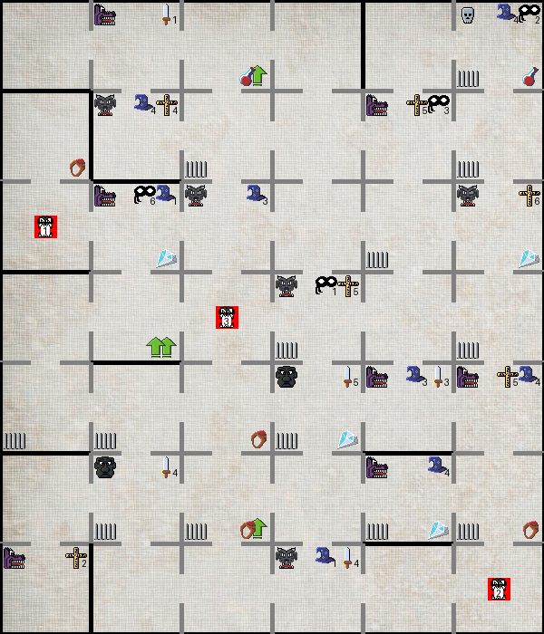

# PaperDungeonsGenerator
I love to play **Paper Dungeons** (edited by Super Meeple in French version or [Alley Cat Games](https://www.alleycatgames.com/paper-dungeons) for the original?) with the kids and I encourage you to buy it. I just want variety on the board, so let's make a random board generator. This is not afiliated with them or the author, just a fan's couple evenings project.

This code losely follows the rules of the original game (buy it!), adding a few extra things. Goal is to have it work with no major amendment to the original rules of the game. Some freedome taken:
- Size is not mandatory 7x6
- Can have multiple nemesis class for a monster
- Can have multiple treasures in a room
- Can start in different cell (not mandatorily bottom one)

# Renderings
## Early rendering 
Like ... "started coding +1h" early. Not too shabby though.

## Adding hand-made sprites

Aseprite is a good software for sprites design, don't judge it by my skills. All handmade originals though!

...and with a parchemin style background:

